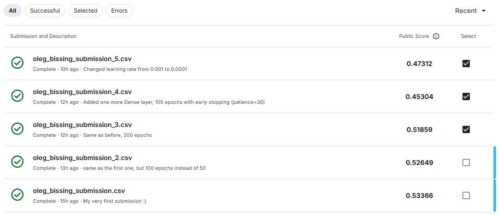
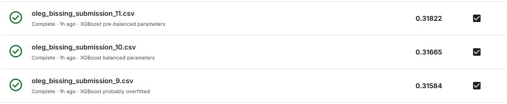

## Introduction

Goal of this project is to enchance my Data Science skills in forecasting. Doing this project I participate in a [Kaggle](https://kaggle.com/competitions/predict-the-wind-speed-at-a-wind-turbine) challenge.

## Background

About the dataset: The data provided is from Kelmarsh wind farm, and covers 6 wind turbines: Kelmarsh 1, the target turbine, which the wind speed needs to be estimated for, and Kelmarsh 2 to Kelmarsh 6, for which comprehensive SCADA data is provided to use in determining the wind speed at Kelmarsh 1.

Below is an example of the data in this table.

| Unnamed: 0 | Timestamp           | Wind speed (m/s)  | Wind speed (m/s).1 | Wind speed (m/s).2 | Wind speed (m/s).3 | Wind speed (m/s).4 | Wind speed, Standard deviation (m/s) | Wind speed, Standard deviation (m/s).1 | Wind speed, Standard deviation (m/s).2 | ... | Generator RPM (RPM).2 | Generator RPM (RPM).3 | Generator RPM (RPM).4 | Blade angle (pitch position) A (°) | Blade angle (pitch position) A (°).1 | Blade angle (pitch position) A (°).2 | Blade angle (pitch position) A (°).3 | Blade angle (pitch position) A (°).4 | training | target_feature |
| ---------- | ------------------- | ----------------- | ------------------ | ------------------ | ------------------ | ------------------ | ------------------------------------ | -------------------------------------- | -------------------------------------- | --- | --------------------- | --------------------- | --------------------- | ---------------------------------- | ------------------------------------ | ------------------------------------ | ------------------------------------ | ------------------------------------ | -------- | -------------- |
| Turbine    | NaN                 | Kelmarsh 2        | Kelmarsh 3         | Kelmarsh 4         | Kelmarsh 5         | Kelmarsh 6         | Kelmarsh 2                           | Kelmarsh 3                             | Kelmarsh 4                             | ... | Kelmarsh 4            | Kelmarsh 5            | Kelmarsh 6            | Kelmarsh 2                         | Kelmarsh 3                           | Kelmarsh 4                           | Kelmarsh 5                           | Kelmarsh 6                           | NaN      | NaN            |
| id         | NaN                 | NaN               | NaN                | NaN                | NaN                | NaN                | NaN                                  | NaN                                    | NaN                                    | ... | NaN                   | NaN                   | NaN                   | NaN                                | NaN                                  | NaN                                  | NaN                                  | NaN                                  | NaN      | NaN            |
| 0          | 2017-10-01 00:00:00 | 9.112874984741213 | 9.197829246520996  | 8.795919418334961  | 8.749383926391602  | 7.6849541664123535 | 1.104222059249878                    | 1.0966191291809082                     | 0.9995877146720886                     | ... | 1768.215087890625     | 1733.296875           | 1603.7493896484375    | 0.1834866404533386                 | 0.1354895979166031                   | 0.0010526315309107                   | 0.0                                  | 0.0                                  | True     | 8.602844       |
| 1          | 2017-10-01 00:10:00 | 8.319863319396973 | 9.350296020507812  | 8.762059211730957  | 8.652318000793457  | 7.421575546264648  | 1.2076553106307983                   | 0.9166100025177002                     | 0.956899106502533                      | ... | 1770.806884765625     | 1737.21826171875      | 1572.7694091796875    | 0.0519975572824478                 | 0.0869988277554512                   | 0.0959980711340904                   | 0.0604995340108871                   | 0.0                                  | True     | 8.125226       |
| 2          | 2017-10-01 00:20:00 | 8.799176216125488 | 8.510401725769043  | 9.533565521240234  | 8.166585922241211  | 7.79703950881958   | 1.124028563499451                    | 0.992840588092804                      | 1.3431802988052368                     | ... | 1766.0023193359375    | 1698.69921875         | 1655.04931640625      | 0.1689876168966293                 | 0.0569967851042747                   | 0.0879981145262718                   | 0.0089999875053763                   | 0.0159999281167984                   | True     | 7.551986       |

## Tools I used (would be updated)

To create a model that predicts wind speed on a turbine I worked with following tools:

- **Pandas** library for working with dataframes
- **matplotlib.pyplot** and **seaborn** libraries for plotting the data
- **sklearn** library for metrics and splitting data
- **Tensorflow** library for machine learning
- **FCNN** model for predictions
- **LightGBM** model for predictions
- **XGBoost** model for predictions

## Data preparation

Dataset is huge with a lot of features (54 columns). It is initially devided into train and test parts. Train part consists of 130608 rows, but 1195 of them have no "target" value so they can not be used for trainig and could be dropped. The remaining rows should also first be examined for missing values.

```python
missing_percentage = (df_train.isnull().sum() / len(df_train)) * 100
print(missing_percentage)

Output:

Unnamed: 0                                     0.000000
Timestamp                                      0.000000
Wind speed (m/s)                               0.023954
Wind speed (m/s).1                            22.252015
Wind speed (m/s).2                             0.028591
Wind speed (m/s).3                             0.169998
Wind speed (m/s).4                             0.085772
Wind speed, Standard deviation (m/s)           0.220225
Wind speed, Standard deviation (m/s).1        22.448286
Wind speed, Standard deviation (m/s).2         0.224861
Wind speed, Standard deviation (m/s).3         0.365497
Wind speed, Standard deviation (m/s).4         0.282043
Wind direction (°)                             0.023954
Wind direction (°).1                          22.107516
Wind direction (°).2                           0.028591
Wind direction (°).3                           0.027818
Wind direction (°).4                           0.085772
Nacelle position (°)                           0.023954
Nacelle position (°).1                        22.107516
Nacelle position (°).2                         0.028591
Nacelle position (°).3                         0.027818
Nacelle position (°).4                         0.085772
Nacelle position, Standard deviation (°)       0.220225
Nacelle position, Standard deviation (°).1    22.303787
Nacelle position, Standard deviation (°).2     0.224861
...
Blade angle (pitch position) A (°).4           0.418041
training                                       0.000000
target_feature                                 0.000000
dtype: float64
```

Numbers are percentage of missing values in the column. There are a lot of missing for the 3rd turbine (".1" values), so one of the solutions could be to drop these columns (filling them with values could be misleading for the model).

There is a .csv file "metaData" with consist of informaion about the turbines (position, hight, etc.) that could help to understand how important 3rd turbine is for predictions on the 1st turbine. Calculated table of the differences to the 1st turbine:

| Title      | Distance to Kelmarsh 1 (km) | Elevation Diff. (m) | Hub Height Diff. (m) |
| ---------- | --------------------------- | ------------------- | -------------------- |
| Kelmarsh 1 | 0.000000                    | 0.000               | 0.000                |
| Kelmarsh 2 | 0.271086                    | 10.979              | 10.979               |
| Kelmarsh 3 | 0.411464                    | 7.879               | -2.121               |
| Kelmarsh 4 | 0.454958                    | 0.715               | 0.715                |
| Kelmarsh 5 | 0.487337                    | -2.697              | -2.697               |
| Kelmarsh 6 | 0.751475                    | -10.559             | -20.559              |

Using these result it could be assumed, that 3rd turbine data is not essential for the predictions on the first one.

Next step would be to drop not essential columns and filling empty cells.

```python
# Interpolate NaNs
df_train_cleaned_NaNs = df_train_cleaned.interpolate(method="pad",limit=None)
missing_values = df_train_cleaned_NaNs.isnull().sum()
print(missing_values)

Output:

Unnamed: 0                                    0
Timestamp                                     0
Wind speed (m/s)                              0
Wind speed (m/s).2                            0
Wind speed (m/s).3                            0
Wind speed (m/s).4                            0
Wind speed, Standard deviation (m/s)          0
Wind speed, Standard deviation (m/s).2        0
Wind speed, Standard deviation (m/s).3        0
Wind speed, Standard deviation (m/s).4        0
Wind direction (°)                            0
Wind direction (°).2                          0
Wind direction (°).3                          0
Wind direction (°).4                          0
Nacelle position (°)                          0
Nacelle position (°).2                        0
Nacelle position (°).3                        0
Nacelle position (°).4                        0
Nacelle position, Standard deviation (°)      0
Nacelle position, Standard deviation (°).2    0
Nacelle position, Standard deviation (°).3    0
Nacelle position, Standard deviation (°).4    0
Vane position 1+2 (°)                         0
Vane position 1+2 (°).2                       0
Vane position 1+2 (°).3                       0
...
Blade angle (pitch position) A (°).4          0
training                                      0
target_feature                                0
dtype: int64
```

Then it is neccesary to drop first two rows with namings and a column "training" hence it only has boolean "true" values.

```python
# List of columns to drop
columns_to_drop = [
    "Unnamed: 0",
    "Timestamp",
    "training"
]

# Drop the specified columns
df_train_ready = df_train_cleaned_NaNs.drop(columns=columns_to_drop, errors='ignore')

# Display the updated df structure
df_train_ready.head()


```

Output:
| Wind speed (m/s) | Wind speed (m/s).2 | Wind speed (m/s).3 | Wind speed (m/s).4 | Wind speed, Std Dev (m/s) | Wind speed, Std Dev (m/s).2 | Wind speed, Std Dev (m/s).3 | Wind speed, Std Dev (m/s).4 | Wind direction (°) | Wind direction (°).2 | Nacelle ambient temperature (°C).4 | Generator RPM (RPM) | Generator RPM (RPM).2 | Generator RPM (RPM).3 | Generator RPM (RPM).4 | Blade angle (pitch position) A (°) | Blade angle (pitch position) A (°).2 | Blade angle (pitch position) A (°).3 | Blade angle (pitch position) A (°).4 | Target Feature |
| ----------------- | ------------------ | ------------------ | ------------------ | ------------------------- | --------------------------- | --------------------------- | --------------------------- | ------------------ | -------------------- | ---------------------------------- | ------------------- | --------------------- | --------------------- | --------------------- | ---------------------------------- | ------------------------------------ | ------------------------------------ | ------------------------------------ | -------------- |
| 9.112874984741213 | 8.795919418334961 | 8.749383926391602 | 7.6849541664123535 | 1.104222059249878 | 0.9995877146720886 | 1.1921913623809814 | 1.290310621261597 | 166.33880615234375 | 166.75782775878906 | 13.829999923706056 | 1793.2969970703125 | 1768.215087890625 | 1733.296875 | 1603.7493896484375 | 0.1834866404533386 | 0.0010526315309107 | 0.0 | 0.0 | 8.602844 |
| 8.319863319396973 | 8.762059211730957 | 8.652318000793457 | 7.421575546264648 | 1.2076553106307983 | 0.956899106502533 | 1.4913365840911863 | 1.180193305015564 | 170.76556396484375 | 170.17349243164062 | 13.802499771118164 | 1755.418701171875 | 1770.806884765625 | 1737.21826171875 | 1572.7694091796875 | 0.0519975572824478 | 0.0959980711340904 | 0.0604995340108871 | 0.0 | 8.125226 |
| 8.799176216125488 | 9.533565521240234 | 8.166585922241211 | 7.79703950881958 | 1.124028563499451 | 1.3431802988052368 | 1.6383079290390017 | 1.3427436351776123 | 171.25563049316406 | 175.37222290039062 | 13.802499771118164 | 1764.6605224609375 | 1766.0023193359375 | 1698.69921875 | 1655.04931640625 | 0.1689876168966293 | 0.0879981145262718 | 0.0089999875053763 | 0.0159999281167984 | 7.551986 |
| 8.392921447753906 | 8.990984916687012 | 7.87704610824585 | 7.750089645385742 | 1.2196468114852903 | 0.97056645154953 | 1.6336950063705444 | 0.8766577243804932 | 178.7187042236328 | 177.27816772460938 | 13.845000267028809 | 1750.111083984375 | 1783.56982421875 | 1661.2645263671875 | 1678.57177734375 | 0.0844920352101326 | 0.0174999069422483 | 0.0 | 0.0 | 7.912114 |
| 8.366286277770996 | 9.335626602172852 | 8.429131507873535 | 8.657709121704102 | 1.4481538534164429 | 1.0075727701187134 | 1.7981107234954834 | 1.3671047687530518 | 177.7423095703125 | 175.983154296875 | 13.889999389648438 | 1717.9464111328125 | 1786.6163330078125 | 1731.586669921875 | 1696.24658203125 | 0.0624961778521537 | 0.3454785346984863 | 0.1854854226112365 | 0.0 | 7.776817 |

Next step would be to do similar job with test dataset and then save these prepared datasets for training.

## Training a FCNN model

Data needs to be correctly initialized and scaled for training. Then a model needs to be initialized.

```python
optimizer = Adam(learning_rate=0.0001)

# Define the FCNN model
model = Sequential([
    Input(shape=(X_train.shape[1],)),
    Dense(128, activation='relu'),
    Dropout(0.3),
    Dense(64, activation='relu'),
    Dropout(0.3),
    Dense(32, activation='relu'),
    Dropout(0.3),
    Dense(1, activation='linear')
])

# Compile the model
model.compile(optimizer=optimizer, loss='mse', metrics=['mae'])

# Model summary
model.summary()
```

After that it could be trained.

```python
history = model.fit(
    X_train, y_train,
    validation_split=0.2,  # Use 20% of training data for validation
    epochs=300,  # Number of epochs (adjust as needed)
    batch_size=32,  # Batch size
    verbose=1 , # Display training progress
    callbacks=[tensorboard_callback]
)
```

After the predictions are done and result properly saved it could be submitted on Kaggle.

While testing different hyperparameters and model architectures I raised my score from 0.53 up to 0.45.



Progress was made, but I still was not happy with my score. It was time to try full datasets (with all turbines) to see how would it affect the result. Model would be used in its best performing settings, which gave a score of 0.45 for a decimated dataset.

Interesting is that the result was the worst of all (0.54), which proves my assomption about dropping one of the turbines to be the right one.


## Training LightGBM model

Before starting with XGBoost which was planned from the very beginning it would be good to try one more model.
Data preparation is the same so that step could be skipped here.
The only difference here is that to evaluate the model performance before comminment I decided to try to split the given train dataset into train and test (80%/20%) and to first evaluate like this (and update hyperparameters if needed).


Results are much better than FCCN. Time to try XGBoost.

## Training XGBoost model

XGBoost model with default parameters performed slightly better than LightGBM.


Time to test different hyperparameters in the same way as with LightGBM model. With the help of ChatGPT all test results were put into following table:

| Model | Max Depth | Learning Rate | N Estimators | Alpha | Gamma | Subsample | Colsample Bytree | RMSE   | Notes                                            |
| ----- | --------- | ------------- | ------------ | ----- | ----- | --------- | ---------------- | ------ | ------------------------------------------------ |
| 1     | 6         | 0.05          | 1000         | -     | -     | -         | -                | 0.4186 | Baseline                                         |
| 2     | 10        | 0.01          | 2000         | -     | -     | -         | -                | 0.4117 | Deeper trees, slower learning rate improved RMSE |
| 3     | 6         | 0.01          | 1000         | -     | -     | -         | -                | 0.4420 | Slower learning rate hurt performance            |
| 4     | 6         | 0.01          | 2000         | -     | -     | -         | -                | 0.4291 | More trees slightly helped                       |
| 5     | 10        | 0.001         | 2000         | -     | -     | -         | -                | 0.6034 | Learning rate too low                            |
| 6     | 10        | 0.1           | 2000         | -     | -     | -         | -                | 0.4140 | Faster learning rate worked well                 |
| 7     | 7         | 0.03          | 1500         | -     | -     | -         | -                | 0.4139 | Balanced depth, rate, and estimators             |
| 8     | 10        | 0.01          | 2000         | -     | 0.1   | -         | -                | 0.4148 | Added gamma                                      |
| 9     | 10        | 0.01          | 2000         | 0.5   | -     | -         | -                | 0.4116 | Added alpha                                      |
| 10    | 10        | 0.01          | 2000         | -     | -     | 0.8       | -                | 0.4075 | Added subsample                                  |
| 11    | 10        | 0.01          | 2000         | -     | -     | -         | 0.8              | 0.4081 | Added colsample_bytree                           |
| 12    | 10        | 0.01          | 2000         | -     | -     | -         | -                | -      | Too slow (dart booster)                          |
| 13    | 10        | 0.01          | 2000         | 0.5   | -     | 0.8       | 0.8              | 0.4068 | Alpha + subsample improved RMSE                  |
| 14    | 10        | 0.01          | 2000         | 0.1   | 0.1   | 0.8       | 0.8              | 0.4060 | Comprehensive tuning                             |
| 15    | 10        | 0.01          | 3000         | 0.1   | 0.005 | 0.7       | 0.5              | 0.4012 | More trees, small gamma improved RMSE            |
| 16    | 10        | 0.01          | 5000         | 0.1   | 0.005 | 0.7       | 0.5              | 0.3989 | Further improvement with more trees              |
| 17    | 10        | 0.001         | 5000         | 0.1   | 0.005 | 0.7       | 0.5              | 0.4224 | Learning rate too low negated gains              |

Three best performing models were chosen for the testing on Kaggle. Here are the results:



My best result is only 0.02 points behind the best overall (3 days to go) and it is 0.22 points better than my first result, which I consider as a satisfying one. After finish of the challenge results and positioning would look a bit different anyway.

**Update:** results are in, in the final Leaderbord I climbed one position higher and finished 13th. Doesn't sound amazing, but again: gap to the 1st place is only 0.02 points and to the last one more than 0.16.
